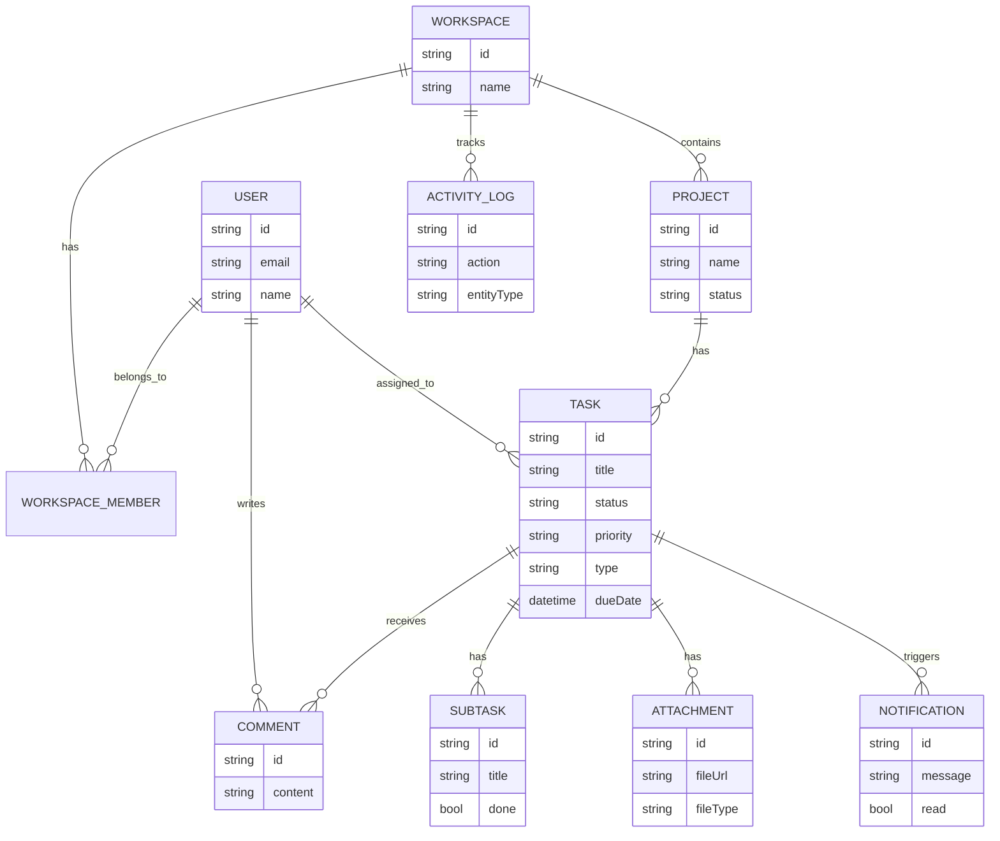

<p align="center">
  
</p>

<h1 align="center">Syncra</h1>

<p align="center">
  <b>Align · Collaborate · Achieve</b><br/>
  <sub>Where teams move in sync — with clarity, control, and confidence.</sub>
</p>

<p align="center">
  
  
  
  
  
  
  
</p>

---

## 📌 Overview

**Syncra** is a full-stack **Project Management & Collaboration Platform** designed to help teams plan, track, and execute work efficiently.

It centralizes **workspaces, projects, tasks, comments, file attachments, analytics, and smart notifications** into a single system — reducing chaos and ensuring **no task or deadline is missed**.

---

## 📸 Screenshots

### 📊 Dashboard & Projects
<p align="center">
  
  
</p>

### ✅ Tasks & Team Management
<p align="center">
  
  
</p>

### 📈 Analytics & Collaboration
<p align="center">
  
  
</p>

---

## 🌟 Key Features

### 🛠 Project & Workflow Management
- Workspace-based organization for teams and projects
- Full task lifecycle — assignees, priority, type, status, and due dates
- Subtask checklists with completion progress tracking
- File attachments on tasks via **Cloudinary** (images, PDFs, documents)
- Activity log & audit trail for every workspace operation
- 1-click **CSV export** for tasks and analytics data

### 🤝 Collaboration & Communication
- Invite members to workspaces via email
- Real-time task-level **Markdown-supported comments** (`react-markdown`)
- Role-Based Access Control (**Admin / Member**)
- Global **Command Palette** (`Cmd+K`) to search across projects, tasks, and users

### 🤖 Automation & Smart Notifications
- Automated email reminders **24 hours before task deadlines**
- Background cron jobs using **Inngest**
- Transactional emails via **Nodemailer + Brevo SMTP**
- In-app notification bell with real-time polling

### 📊 Analytics & Insights
- **Velocity Chart** — Task completion rate over the last 7 days
- **Member Workload Chart** — Active task distribution across assignees
- **Project Analytics Tab** — Completion rate, overdue count, priority breakdown

### 🎨 Modern User Experience
- Premium **Landing Page v3** with glassmorphism, ambient glow effects, and animated version indicator
- Deep **dark mode first** design across the entire app
- Responsive UI with **React (Vite)** and **Tailwind CSS v4**
- Glassmorphism cards, smooth micro-animations, and premium typography
- Secure authentication powered by **Clerk**

---

## 🧠 System Design (High Level)

- **Auth Layer:** Clerk handles authentication and session management
- **API Layer:** Express.js REST APIs with middleware protection (Helmet, Rate Limiting, Zod validation)
- **Database Layer:** Neon PostgreSQL with Prisma ORM
- **File Storage:** Cloudinary for task attachments
- **Async Jobs:** Inngest for deadline reminders and background workflows
- **Notifications:** Nodemailer integrated with Brevo SMTP
- **Frontend:** React (Vite) with Redux Toolkit

---

## 🗂 Database Design (ER Diagram)


```mermaid
erDiagram
    USER ||--o{ WORKSPACE_MEMBER : belongs_to
    WORKSPACE ||--o{ WORKSPACE_MEMBER : has
    WORKSPACE ||--o{ PROJECT : contains
    PROJECT ||--o{ TASK : has
    TASK ||--o{ COMMENT : receives
    TASK ||--o{ SUBTASK : has
    TASK ||--o{ ATTACHMENT : has
    TASK ||--o{ NOTIFICATION : triggers
    USER ||--o{ TASK : assigned_to
    USER ||--o{ COMMENT : writes
    WORKSPACE ||--o{ ACTIVITY_LOG : tracks

    USER {
      string id
      string email
      string name
    }

    WORKSPACE {
      string id
      string name
    }

    PROJECT {
      string id
      string name
      string status
    }

    TASK {
      string id
      string title
      string status
      string priority
      string type
      datetime dueDate
    }

    SUBTASK {
      string id
      string title
      bool done
    }

    ATTACHMENT {
      string id
      string fileUrl
      string fileType
    }

    COMMENT {
      string id
      string content
    }

    NOTIFICATION {
      string id
      string message
      bool read
    }

    ACTIVITY_LOG {
      string id
      string action
      string entityType
    }
```

## 🗂 Database Design (ER Overview)

```text
User
 └── WorkspaceMember
      └── Workspace
           ├── ActivityLog
           └── Project
                └── Task
                     ├── Subtask
                     ├── Attachment
                     ├── Comment
                     └── Notification
```

- **Users** can be members of multiple **Workspaces**.
- **Workspaces** contain multiple **Projects** and a persistent **Activity Log**.
- **Projects** are broken down into **Tasks**.
- **Tasks** support **Subtasks**, **Attachments**, **Comments**, and **Notifications**.

---

## 🏗 Architecture & Tech Stack

Syncra follows a modern monorepo structure with a separated frontend and backend.

```text
Syncra/
├── backend/                # Node.js & Express API
│   ├── configs/            # Cloudinary, Prisma setup
│   ├── controllers/        # Business logic & request handling
│   ├── inngest/            # Background job functions (deadline reminders)
│   ├── middlewares/        # Auth verification, Zod validation
│   ├── prisma/             # Database schema
│   ├── routes/             # API route definitions
│   └── server.js           # Application entry point
│
└── frontend/               # React (Vite) Client
    ├── src/
    │   ├── components/     # Reusable UI elements
    │   ├── features/       # Redux state slices
    │   ├── pages/          # Application views
    │   ├── configs/        # Axios instance
    │   └── assets/         # Images and media
    └── vite.config.js
```

### Technology Stack

| Category | Technologies |
|---|---|
| **Frontend** | React.js (Vite), Redux Toolkit, Tailwind CSS v4, Recharts, React-Markdown |
| **Backend** | Node.js, Express.js, Prisma ORM, Inngest, Nodemailer |
| **Database** | Neon PostgreSQL (serverless) |
| **Auth** | Clerk |
| **File Storage** | Cloudinary |
| **Security** | Helmet, Express Rate Limit, CORS, Zod Validation |
| **DevOps** | Vercel (deployment ready), Git |

---

## 📡 API Overview

All APIs are RESTful and secured via Clerk authentication middleware.

| Module | Endpoint | Description |
|---|---|---|
| **Workspaces** | `/api/workspaces` | Create and manage workspaces, invite members |
| **Projects** | `/api/projects` | CRUD operations for projects |
| **Tasks** | `/api/tasks` | Manage task lifecycle, assignments, deadlines |
| **Subtasks** | `/api/subtasks` | Create and toggle task checklists |
| **Comments** | `/api/comments` | Post and retrieve markdown comments on tasks |
| **Attachments** | `/api/attachments` | Upload/delete files via Cloudinary |
| **Notifications** | `/api/notifications` | Fetch and mark notifications as read |
| **Activity Log** | `/api/activity` | Retrieve workspace audit trail |
| **Analytics** | `/api/analytics` | Fetch project progress and insights |

---

## 🚀 Getting Started

Run Syncra locally in a few simple steps.

### Prerequisites

- Node.js v18+ & npm
- [Neon](https://neon.tech) PostgreSQL database
- [Clerk](https://clerk.com) account (for auth keys)
- [Cloudinary](https://cloudinary.com) account (for file storage)
- Brevo / SMTP account (for emails)

---

### 1️⃣ Clone the Repository

```bash
git clone https://github.com/devbyhimans/Syncra.git
cd Syncra
```

---

### 2️⃣ Backend Setup

```bash
cd backend
npm install
```

Create a `.env` file in the `backend` directory:

```env
PORT=5001
DATABASE_URL="postgresql://..."          # Neon → Connection String
DIRECT_URL="postgresql://..."            # Neon → Direct Connection String
CLERK_PUBLISHABLE_KEY="pk_test_..."
CLERK_SECRET_KEY="sk_test_..."
CLOUDINARY_CLOUD_NAME="your-cloud-name"
CLOUDINARY_API_KEY="your-api-key"
CLOUDINARY_API_SECRET="your-api-secret"
SMTP_HOST="smtp-relay.brevo.com"
SMTP_PORT=587
SMTP_USER="your_email@example.com"
SMTP_PASS="your_smtp_password"
SENDER_EMAIL="no-reply@syncra.com"
FRONTEND_URL="http://localhost:5173"
```

Push the database schema and start the server:

```bash
npx prisma db push
npm start
```

Backend runs at **http://localhost:5001**

---

### 3️⃣ Frontend Setup

Open a new terminal:

```bash
cd frontend
npm install
```

Create a `.env` file in the `frontend` directory:

```env
VITE_CLERK_PUBLISHABLE_KEY="pk_test_..."
VITE_API_URL="http://localhost:5001"
```

Start the development server:

```bash
npm run dev
```

Visit **http://localhost:5173** to use Syncra!

---

## ☁️ Deployment on Vercel

Syncra uses a **split deployment** model — backend and frontend deployed as separate Vercel projects.

### Step 1: Deploy the Backend
1. Import your repo on [vercel.com](https://vercel.com), set **Root Directory** to `backend`
2. Set **Build Command** to: `npm install && npx prisma generate`
3. Add all backend `.env` variables
4. Deploy and copy the backend URL (e.g., `https://syncra-api.vercel.app`)

### Step 2: Deploy the Frontend
1. Add another Vercel project from the same repo, set **Root Directory** to `frontend`
2. Set **Framework Preset** to `Vite`
3. Add `VITE_CLERK_PUBLISHABLE_KEY` and `VITE_API_URL` (your backend URL)
4. Deploy and copy the frontend URL (e.g., `https://syncra.vercel.app`)

### Step 3: Update CORS
Go back to your backend Vercel project → update `FRONTEND_URL` to your live frontend URL → **Redeploy**.

---

## 🔒 Security

- **Authentication:** Secured by Clerk — session management and user identity
- **Authorization:** All API routes protected by auth middleware
- **RBAC:** Critical actions (workspace settings, member management) restricted to Admins
- **Rate Limiting:** `express-rate-limit` prevents abuse and DDoS
- **Data Validation:** Zod schemas validate all request payloads
- **Security Headers:** `helmet` sets secure HTTP response headers

---

## 🧭 Future Roadmap

- [ ] **Real-time Collaboration:** WebSocket-based live updates (Socket.io)
- [ ] **Calendar Integration:** Sync tasks with Google / Outlook calendars
- [ ] **AI-Powered Insights:** Smart predictions for project timelines and bottlenecks
- [ ] **PDF Reports:** Export project analytics as PDF documents
- [ ] **Mobile App:** React Native companion app

---

## 🤝 Contributing

Contributions are welcome! Please fork the repository, create a feature branch, and submit a Pull Request.

---

## 📄 License

This project is licensed under the **MIT License**.

---

## 📞 Contact

**Himanshu**

- **GitHub:** [@devbyhimans](https://github.com/devbyhimans)
- **Project Link:** [https://github.com/devbyhimans/Syncra](https://github.com/devbyhimans/Syncra)

---

<p align="center">Built with ❤️ by Himanshu</p>
