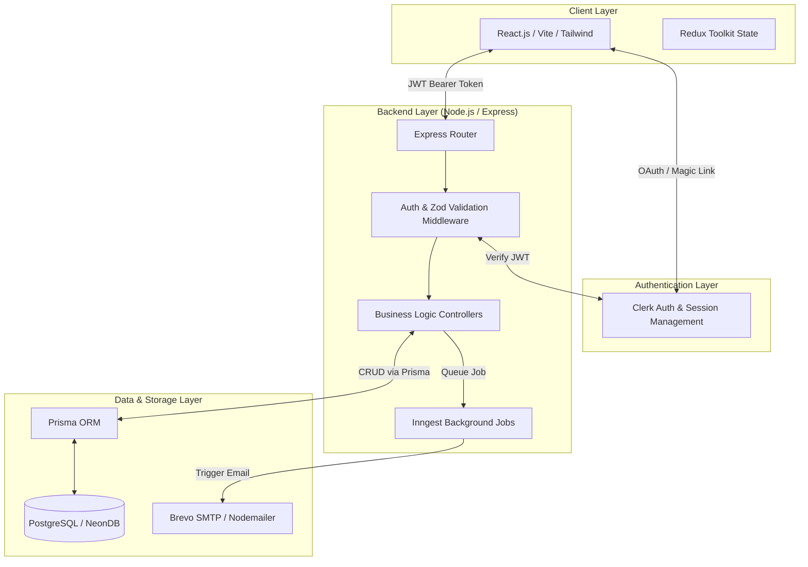
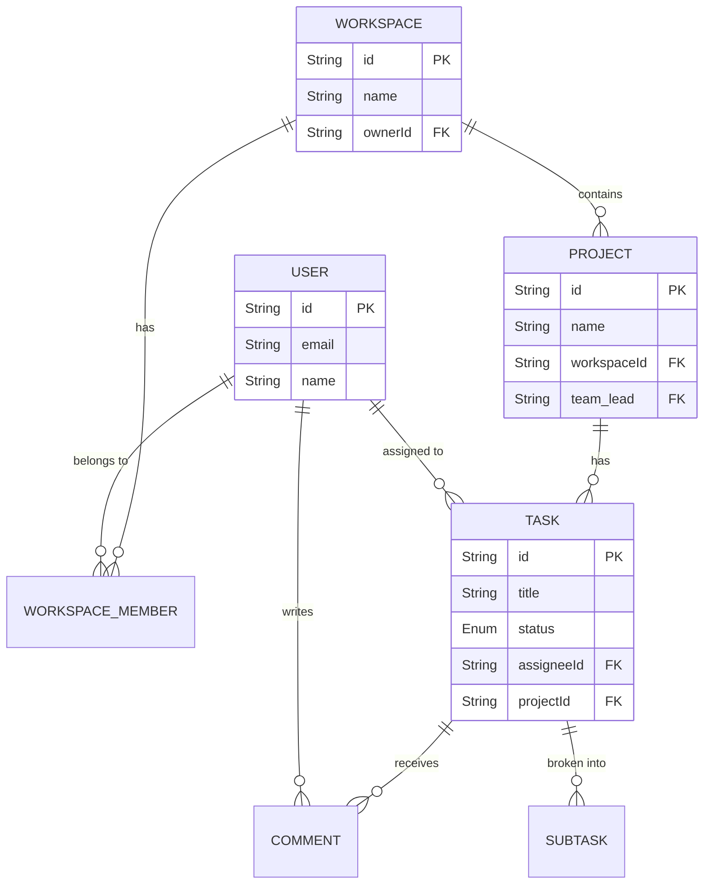
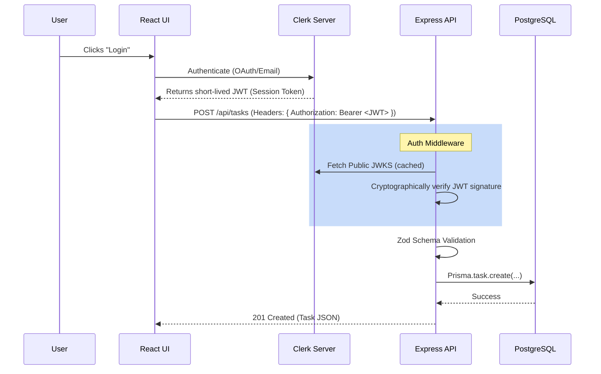

# Syncra — Senior Staff Technical Interview Prep

> [!WARNING]
> **Crucial Stack Discrepancy Alert**
> Your prompt mentioned **MongoDB**. However, your actual `schema.prisma` in the Syncra codebase uses `provider = "postgresql"` and connects to a **NeonDB (Serverless PostgreSQL)** database. 
> 
> *If you tell the interviewer you used MongoDB but they look at your GitHub, it will be an immediate red flag.* 
> 
> I have structured this document to accurately reflect your **actual** PostgreSQL architecture so you can defend your real code, but I have included a dedicated sub-section on **MongoDB vs PostgreSQL in Prisma** to explicitly answer your prompt and prepare you in case they ask "Why didn't you use MongoDB?"

---

## 1. System Architecture & High-Level Design

### Architecture Diagram

### Whiteboard Presentation Narrative
"Syncra is a decoupled, full-stack application built for high velocity and scalability. 

The frontend is a **React SPA built with Vite**, utilizing **Redux Toolkit** for complex state management (like Kanban board state and optimistic updates). It communicates with the backend via REST APIs.

For authentication, I delegated identity management to **Clerk**. Clerk issues short-lived JWTs to the client, which are passed in the `Authorization` header to my Express backend. My backend has a custom middleware that verifies these JWTs using Clerk's public keys, ensuring zero trust.

The backend is built on **Node.js and Express**. Requests pass through rate limiters, security headers (Helmet), and schema validation (Zod) before hitting the controllers. 

For the data layer, I chose **PostgreSQL** hosted on NeonDB (serverless), interfaced via **Prisma ORM**. I chose this because project management data is inherently highly relational (Users → Workspaces → Projects → Tasks → Comments). Finally, I offloaded heavy operations like task assignment emails and 24-hour due-date reminders to **Inngest**, a serverless queueing mechanism that triggers **Nodemailer**."

### Trade-offs: Why this stack over the alternatives?
* **Why React (Vite) over Next.js?** Next.js is fantastic for SEO and server-side rendering, but Syncra is a heavily authenticated dashboard application where SEO is not a priority (except for the landing page). A pure React SPA built with Vite offers faster hot-module replacement during development and decouples the frontend completely from the backend, allowing them to scale independently.
* **Why Node.js/Express over NestJS or Go?** Node.js allows for a single language (TypeScript/JavaScript) across the entire stack, reducing context switching. Express was chosen over NestJS because Syncra didn't require the heavy, opinionated boilerplate of Angular-style dependency injection; Express is lightweight and allowed me to move fast.
* **Why Clerk over Auth0 or Custom JWT Auth?** Building secure authentication from scratch (handling password resets, 2FA, session invalidation, OAuth providers) takes weeks and is prone to security flaws. Clerk provides drop-in components, B2B organizational/workspace features out-of-the-box, and stateless JWTs that integrate perfectly with an Express backend.
* **Relational Integrity (PostgreSQL wins over MongoDB):** A project management tool relies on cascading deletes and strict relationships. If a Workspace is deleted, all Projects, Tasks, and Comments must be deleted. PostgreSQL enforces this at the database level with Foreign Keys. MongoDB requires the application layer to handle cascading deletes, risking orphaned documents.
* **Join Performance:** Fetching a Dashboard requires joining Workspaces, Projects, Tasks, and Members. Prisma on PostgreSQL compiles this into efficient SQL `JOIN`s. Prisma on MongoDB has to emulate joins in the application memory or use complex `$lookup` aggregation pipelines, which is slower at scale.
* **Why Prisma over TypeORM/Sequelize/Mongoose?** Prisma provides end-to-end type safety. The schema is the single source of truth. If I change a column in the database, my TypeScript compiler will fail in the controller before I even run the code. Mongoose (for MongoDB) is loosely typed and relies on manual interface syncing.

---

## 2. Prisma Design & Data Modeling

### Entity-Relationship Diagram (ERD)

### Handling Relationships (If using MongoDB instead of PostgreSQL)
*If the interviewer asks: "How would Prisma handle this if we swapped to MongoDB?"*

**Answer:** "MongoDB is a document store, so it doesn't have foreign keys. In Prisma with MongoDB, relationships are defined using the `@relation` attribute just like SQL, but under the hood, Prisma stores the related `ObjectId` in a scalar array or scalar field. 
- For 1:n (Project to Tasks), Prisma stores the `projectId` on the Task document.
- For m:n (implicit many-to-many), Prisma actually stores an array of `ObjectId`s on both sides (e.g., `taskIds String[] @db.ObjectId`). 
- **The Catch:** Because there are no real foreign keys, Prisma handles cascading deletes at the *engine level* (application side), not the database side. This means if I delete a Project, the Prisma engine runs a `find` query to get all Tasks, then runs a `deleteMany` query. This requires more network round-trips than PostgreSQL."

### Performance Implications & Indexing (PostgreSQL & MongoDB)
1. **Indexes are critical:** In my schema, I explicitly added `@@index([projectId, status])` on the `Task` model. This is because the Kanban board frequently queries `WHERE projectId = X AND status = Y`. Without this composite index, the database would do a full collection/table scan.
2. **N+1 Query Problem:** A common pitfall in ORMs. If I fetch 50 tasks, and then loop through them to fetch their assignees, I'm making 51 queries. I solved this using Prisma's `include: { assignee: true }`, which translates to a single `JOIN` in PostgreSQL (or an optimized `$in` query in MongoDB).

---

## 3. User & Request Handling

### Authentication Flow (Clerk)

### The Request Lifecycle
1. **Routing:** The request hits Express (`/api/v1/tasks`).
2. **Middleware 1 (Security):** `helmet()` adds secure HTTP headers. `express-rate-limit` checks if the IP is spamming.
3. **Middleware 2 (Auth):** `requireAuth` extracts the JWT from the `Authorization` header. It verifies the cryptographic signature using Clerk's public keys. It extracts the `userId` and attaches it to `req.auth`.
4. **Middleware 3 (Validation):** A Zod middleware intercepts `req.body`. If the client sent `dueDate: "invalid-date"`, Zod instantly aborts the request and returns a 400 Bad Request.
5. **Controller:** The `createTask` function executes. It verifies that `req.auth.userId` has permission to add tasks to this specific workspace.
6. **Data Access:** `prisma.task.create()` is called.
7. **Background Job:** `inngest.send({ name: "app/task.assigned", data: { taskId } })` is fired off non-blockingly.
8. **Response:** A 201 JSON response is sent back to the client.

---

## 4. High-Probability Interview Questions & Answers

**1. "You used Clerk for auth. What happens if Clerk goes down? How does your backend handle session verification without making a network call to Clerk on every request?"**
> **Answer:** "Clerk issues stateless JWTs. My backend doesn't actually need to call Clerk's servers on every request. I use Clerk's SDK (or standard JWT libraries) which caches Clerk's Public JWKS (JSON Web Key Set). The backend verifies the cryptographic signature locally in memory. The only time it calls Clerk is to refresh the cached JWKS when keys rotate. If Clerk goes down entirely, users already logged in will stay logged in until their short-lived token expires."

**2. "How are you handling authorization (RBAC) vs. authentication? Just because I am logged in doesn't mean I can delete a project."**
> **Answer:** "Clerk handles *Authentication* (Who are you?). My backend handles *Authorization* (What can you do?). In my `WorkspaceMember` table, there is a `role` enum (`ADMIN`, `MEMBER`). In the controller for `deleteProject`, I first query Prisma to ensure `req.auth.userId` exists in `WorkspaceMember` for that workspace AND has the `ADMIN` role. If not, I throw a 403 Forbidden."

**3. "You have a feature that sends an email 24 hours before a task is due. How exactly does that work? Why not just use `setTimeout` or `setInterval` in Express?"**
> **Answer:** "Using `setTimeout` in Node.js is an anti-pattern for long-running jobs because if the Express server restarts or crashes, the timeout is lost from memory. Instead, I used Inngest. When a task is created, I enqueue an event to Inngest with the `dueDate`. Inngest has a `step.sleepUntil()` function. The function essentially 'sleeps' in Inngest's durable cloud queue. If my server restarts, it doesn't matter; Inngest persists the state and will hit my webhook exactly 24 hours before the due date to trigger the Nodemailer function."

**4. "If you fetch a Project, how do you prevent the N+1 query problem when fetching its 100 Tasks and their Assignees?"**
> **Answer:** "I use Prisma's nested `include`. Instead of fetching the project, then doing a `for` loop to fetch tasks, I query `prisma.project.findUnique({ where: { id }, include: { tasks: { include: { assignee: true } } } })`. Prisma compiles this into an optimized SQL query using `LEFT JOIN`s (or a bundled batch query), resolving everything in a single database round-trip."

**5. "What was the most challenging problem you faced while building Syncra, and how did you overcome it?"**
> **Answer:** "One of the most frustrating problems involved CORS and environment deployments. My frontend and backend were deployed separately on Vercel. When I created PRs, Vercel generated dynamic preview URLs (e.g., `syncra-frontend-git-main...vercel.app`). My backend was configured to only accept requests from the exact `FRONTEND_URL` in production, so all my preview deployments broke due to CORS preflight failures. 
> 
> *How I overcame it:* Instead of wildly opening CORS to `*` (which is a major security risk), I updated the Express CORS configuration to accept an array of origins that included my production URL, `localhost`, and a regular expression `/\.vercel\.app$/`. This allowed dynamic preview branches to communicate with the API securely without exposing the backend to the entire internet."

**6. "How are you handling state management on the frontend, specifically for the Kanban board? Why Redux Toolkit over React Context?"**
> **Answer:** "React Context is great for global settings like theme or auth state, but it causes full re-renders for all consumers when the value changes. The Kanban board has highly volatile state—tasks are dragged and dropped constantly. Redux Toolkit allows components to subscribe only to specific slices of state. When I drag a task, I apply an *optimistic update* to the Redux store instantly, making the UI feel snappy, while the `PATCH` request happens in the background. If the request fails, I rollback the Redux state."

**7. "If multiple users are updating the same task's status at the same time, how do you handle race conditions?"**
> **Answer:** "Currently, it's a 'last write wins' scenario based on REST. However, for a robust production app, I would implement Optimistic Concurrency Control (OCC). I would add a `version` integer column to the `Task` table. When the frontend sends an update, it includes the version it currently has. Prisma would do `update({ where: { id, version }, data: { status, version: { increment: 1 } } })`. If another user updated it first, the version would have changed, the query would affect 0 rows, and my API would return a 409 Conflict."

**8. "Why did you choose Prisma over raw SQL queries? Isn't Prisma slower?"**
> **Answer:** "Prisma introduces a slight overhead due to its Rust-based query engine layer, but the developer experience and type safety heavily outweigh it for this project. With raw SQL, a typo in a column name or a type mismatch (e.g., passing a string to an integer column) isn't caught until runtime. Prisma auto-generates TypeScript types based on my schema. If I change a database column, my TypeScript build fails instantly. That safety prevents massive production bugs."

**9. "How does your global search (Cmd+K) work? Does it query the database on every keystroke?"**
> **Answer:** "No, that would destroy the database and cause rate-limiting issues. Since project and task data is already fetched and stored in the Redux store when the user loads a workspace, I use `fuse.js` on the frontend for the Cmd+K palette. It does fuzzy client-side searching against the in-memory Redux arrays. It's instantaneous and requires zero API calls."

**10. "Tell me about your CORS configuration. Why is it important?"**
> **Answer:** "CORS (Cross-Origin Resource Sharing) protects the API from being called by malicious websites. Initially, an app might use `app.use(cors())`, which acts as a wildcard allowing any domain to hit the API. I hardened this by explicitly setting the `origin` option to `process.env.FRONTEND_URL`. This ensures that only my Vercel-hosted frontend can make valid `fetch` requests to my Express backend in the browser."
